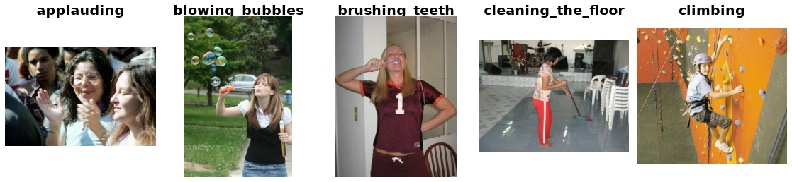

Stanford40
==========

.. raw:: html

   

   
   
   
   

Overview
--------

Stanford40 contains 9,532 still images of people performing 40 actions,
such as reading, riding a bike, and playing a guitar. It is a single-label
image classification dataset with 180 to 300 images per action class.

This loader uses the official train/test split files:

- **Train**: 4,000 images (100 per class)
- **Test**: 5,532 images

Images are returned at their original resolution. The loader uses the full
images; it does not load the bounding-box annotations or crop to the person.
Labels are zero-based indices into alphabetically sorted action names.
No separate validation split is provided.

Data Structure
--------------

When accessing an example using ``ds[i]``, you receive a dictionary with
the following keys:

.. list-table::
   :header-rows: 1
   :widths: 20 25 55

   * - Key
     - Type
     - Description
   * - ``image``
     - ``PIL.Image.Image``
     - Full action image at its original resolution.
   * - ``label``
     - ``int``
     - Action class index (0-39).

Usage Example
-------------

**Basic Usage**

Save this example as a Python file and run it. The main guard supports
platforms that use multiprocessing with the spawn start method.

.. code-block:: python

    from stable_datasets.images.stanford40 import Stanford40

    def main():
        # First load downloads the data and prepares the processed cache.
        # Later loads reuse the cache and return a StableDataset.
        train = Stanford40(split="train")
        test = Stanford40(split="test")

        sample = train[0]
        print(sample.keys())  # image, label
        print(sample["image"].size)
        print(sample["label"])
        print(len(train), len(test))  # 4000 5532

        # Look up the action name for a label.
        class_names = train.features["label"].names
        print(class_names[sample["label"]])

        # Load all available splits as a StableDatasetDict.
        all_splits = Stanford40(split=None)
        print(all_splits.keys())  # train, test

        # Optionally request PyTorch-formatted samples.
        train_torch = train.with_format("torch")
        print(train_torch[0]["image"].shape)

    if __name__ == "__main__":
        main()

Images have variable sizes. Apply suitable resizing or cropping before
stacking them into training batches.

Related Datasets
----------------

- **PASCAL VOC Action Images**: Human action classification in still images.
- **PPMI**: Images of people playing or holding musical instruments.

References
----------

- `Official dataset website <http://vision.stanford.edu/Datasets/40actions.html>`_
- `Source images <http://vision.stanford.edu/Datasets/Stanford40_JPEGImages.zip>`_
- `Official split files <http://vision.stanford.edu/Datasets/Stanford40_ImageSplits.zip>`_
- `Paper <https://people.csail.mit.edu/khosla/papers/iccv2011_yao_full.pdf>`_

Citation
--------

.. code-block:: bibtex

    @inproceedings{yao2011human,
      title = {Human Action Recognition by Learning Bases of Action Attributes and Parts},
      author = {Yao, Bangpeng and Jiang, Xiaoye and Khosla, Aditya and
                Lin, Andy Lai and Guibas, Leonidas and Fei-Fei, Li},
      booktitle = {2011 International Conference on Computer Vision},
      year = {2011}
    }
