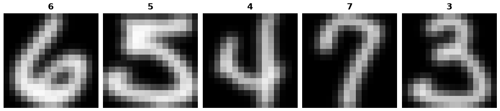

USPS
====

.. raw:: html

   

   
   
   
   

Overview
--------

USPS is a handwritten digit classification dataset containing 9,298
16 x 16 grayscale images across 10 classes. This loader uses the LIBSVM
distribution and preserves its provided splits:

- **Train**: 7,291 images
- **Test**: 2,007 images

The source files store each image as 256 pixel features in LIBSVM format.
Pixel values are converted from [-1, 1] to [0, 255] and cast to uint8
to construct grayscale images. No separate validation split is provided.

Label Convention
----------------

Source labels from 1 to 10 are converted to indices from 0 to 9 by
subtracting 1, following the torchvision USPS convention. These are class
indices in the source encoding, rather than the literal digit values
shown in the images.

Data Structure
--------------

When accessing an example using ``ds[i]``, you receive a dictionary with
the following keys:

.. list-table::
   :header-rows: 1
   :widths: 20 25 55

   * - Key
     - Type
     - Description
   * - ``image``
     - ``PIL.Image.Image``
     - 16 x 16 grayscale image with uint8 pixel values.
   * - ``label``
     - ``int``
     - Zero-based class index (0-9), following the source label order.

Usage Example
-------------

**Basic Usage**

Save this example as a Python file and run it. The main guard supports
platforms that use multiprocessing with the spawn start method.

.. code-block:: python

    from stable_datasets.images.usps import USPS

    def main():
        # First load downloads the data and prepares the processed cache.
        # Later loads reuse the cache and return a StableDataset.
        train = USPS(split="train")
        test = USPS(split="test")

        sample = train[0]
        print(sample.keys())  # image, label
        print(sample["image"].size)  # (16, 16)
        print(sample["image"].mode)  # L
        print(sample["label"])
        print(len(train), len(test))  # 7291 2007

        # Load all available splits as a StableDatasetDict.
        all_splits = USPS(split=None)
        print(all_splits.keys())  # train, test

        # Optionally request PyTorch-formatted samples.
        train_torch = train.with_format("torch")
        print(train_torch[0]["image"].shape)

    if __name__ == "__main__":
        main()

Related Datasets
----------------

- **MNIST**: Handwritten digit recognition with 28 x 28 grayscale images.
- **EMNIST**: Handwritten character recognition, including letters and digits.
- **SVHN**: Digit recognition using natural images of house numbers.

References
----------

- `LIBSVM dataset page <https://www.csie.ntu.edu.tw/~cjlin/libsvmtools/datasets/multiclass.html#usps>`_
- `Training data <https://www.csie.ntu.edu.tw/~cjlin/libsvmtools/datasets/multiclass/usps.bz2>`_
- `Test data <https://www.csie.ntu.edu.tw/~cjlin/libsvmtools/datasets/multiclass/usps.t.bz2>`_
- `torchvision USPS implementation <https://docs.pytorch.org/vision/stable/_modules/torchvision/datasets/usps.html>`_

Citation
--------

The LIBSVM dataset page cites the following reference for USPS:

.. code-block:: bibtex

    @article{hull1994database,
      author = {Hull, J. J.},
      title = {A Database for Handwritten Text Recognition Research},
      journal = {IEEE Transactions on Pattern Analysis and Machine Intelligence},
      volume = {16},
      number = {5},
      pages = {550--554},
      year = {1994}
    }